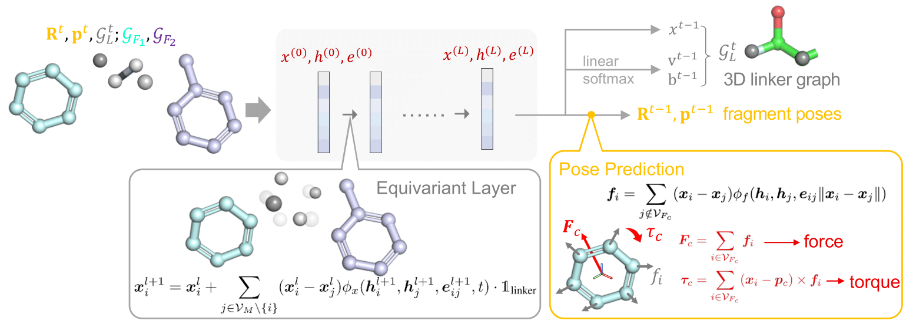

# LinkerNet: Fragment Poses and Linker Co-Design with 3D Equivariant Diffusion

[](https://github.com/guanjq/targetdiff/blob/main/LICIENCE)


This repository is the official implementation of LinkerNet: Fragment Poses and Linker Co-Design with 3D Equivariant Diffusion (NeurIPS 2023). [[PDF]](https://openreview.net/forum?id=6EaLIw3W7c) 

<p align="center">
   
</p>

## Installation

### Dependency

The code has been tested in the following environment:


| Package           | Version   |
|-------------------|-----------|
| Python            | 3.8       |
| PyTorch           | 1.13.1    |
| CUDA              | 11.6      |
| PyTorch Geometric | 2.2.0     |
| RDKit             | 2022.03.2 |

### Install via Conda and Pip
```bash
conda create -n targetdiff python=3.8
conda activate targetdiff
conda install pytorch pytorch-cuda=11.6 -c pytorch -c nvidia
conda install pyg -c pyg
conda install rdkit openbabel tensorboard pyyaml easydict python-lmdb -c conda-forge
```

---
## Data Preprocess

### PROTAC-DB

We have provided all data files related to PROTAC-DB dataset in this repo. 
* The raw data (.csv files in the data/protac folder) are downloaded from [PROTAC-DB](http://cadd.zju.edu.cn/protacdb/).
* The index.pkl file is obtained in playground/check_data.ipynb
* The 3d_index.pkl file containing the conformation generated by RDKit, which is obtained by running the following command:

```bash
python scripts/prepare_data.py --raw_path data/protac/index.pkl --dest data/protac/3d_index.pkl
```

Note that RDKit version may influence the PROTAC-DB dataset processing and splitting. We provided the processed data and split file [here](https://drive.google.com/drive/folders/1Nt37DO1PYwPNM0_uF2Zzz4QxWD3v8pF6?usp=drive_link)

### ZINC

The raw ZINC data are same as [DiffLinker](https://zenodo.org/records/7121271).
We preprocess ZINC data to output an index file by running:
```bash
python scripts/prepare_data.py \
    --raw_path data/zinc_difflinker \
    --dest data/zinc_difflinker/index_full.pkl \
    --dataset zinc_difflinker --mode full
```
We also provided the preprocessed index file [here](https://drive.google.com/drive/folders/1C1srELCCNJLk8v1smjvmbE-xYvnog5jU?usp=sharing).

---
## Training
    python scripts/train_protac.py configs/training/zinc.yml

We have provided the [pretrained checkpoints](https://drive.google.com/drive/folders/1C1srELCCNJLk8v1smjvmbE-xYvnog5jU?usp=sharing) on ZINC / PROTAC. 

## Sampling
    python scripts/sample_protac.py configs/sampling/zinc.yml --subset test --start_id 0 --end_id -1 --num_samples 250 --outdir outputs/zinc

We have also provided the sampling results in the same link.


## Evaluation
    python scripts/eval_protac.py {SAMPLE_RESULT_DIR}


## Citation
```
@inproceedings{guan2023linkernet,
  title={LinkerNet: Fragment Poses and Linker Co-Design with 3D Equivariant Diffusion},
  author={Guan, Jiaqi and Peng, Xingang and Jiang, PeiQi and Luo, Yunan and Peng, Jian and Ma, Jianzhu},
  booktitle={Thirty-seventh Conference on Neural Information Processing Systems},
  year={2023}
}
```